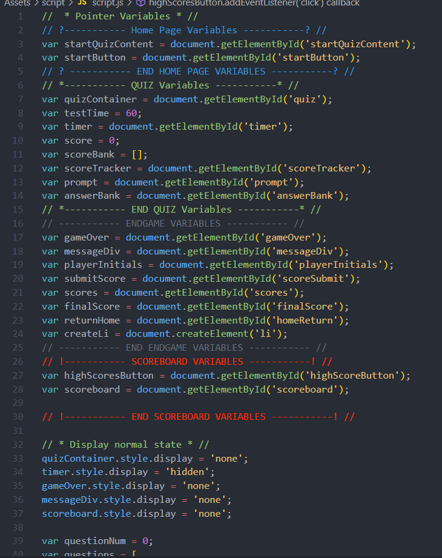
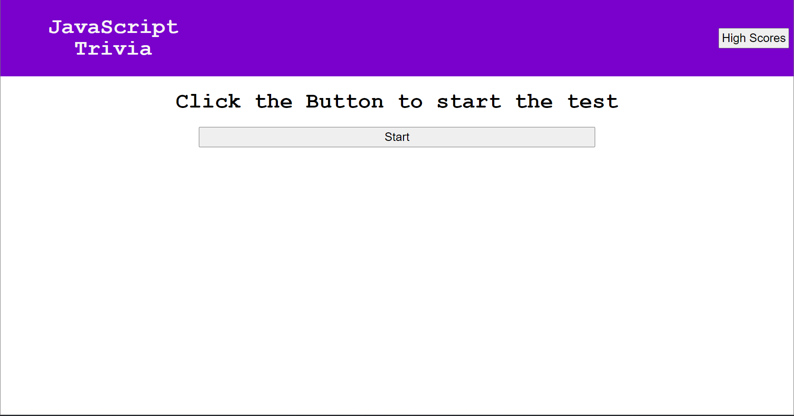
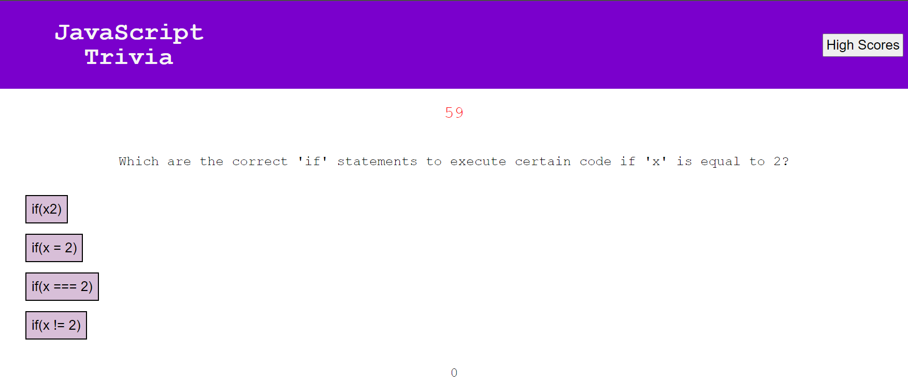

# javascript-fundamentals-quiz

# Introduction

This project is meant to test your knowledge of javascript fundamentals. This quiz will be a timed session to see how fast you can answer the 5 questions.

During the quiz, if you select an answer that is correct, your score will be added by 10 points. However, if you select an incorrect answer, your time will decrease by 10 seconds and you will not receive any points. the quiz has a total of 50 points.

Test your knowledge and then compare your scores inside the highscore section to see who has the most knowledge when it comes to javascript.

# Deployed Application

## [Javascript Trivia](https://pn-barnes.github.io/javascript-trivia/)

# Description

The quiz is composed of HTML, CSS, and Javascript to complete the functionality of the test. This uses the local storage of the browser to save the scores to the page and keeping them even after a browser refresh. The javascript consists of even listeners for the button answer choices as well as functions that control the time, the game over functionality, the save score, and the answer key checker to see if answers are correct or not.

# Installation

[github Repository](https://github.com/PN-Barnes/javascript-fundamentals-quiz)

[VS Code](https://code.visualstudio.com/)

[node.js](https://nodejs.org/en/)

# References

## [HTML](https://developer.mozilla.org/en-US/docs/Web/HTML)

## [CSS](https://developer.mozilla.org/en-US/docs/Web/CSS)

## [Javascript](https://developer.mozilla.org/en-US/docs/Web/JavaScript)

#### [Scope](https://developer.mozilla.org/en-US/docs/Glossary/Scope)

#### [For Loops](https://developer.mozilla.org/en-US/docs/Web/JavaScript/Reference/Statements/for)

#### [If/Else statements](https://developer.mozilla.org/en-US/docs/Web/JavaScript/Reference/Statements/if...else)

#### [Variables](https://developer.mozilla.org/en-US/docs/Web/JavaScript/Reference/Statements/var)
